# Plano Arquitetural: Transmissão de Vídeo P2P 1080p 60 FPS (Litecord)

Este documento descreve a arquitetura, o diagnóstico técnico e o plano de implementação para o sistema de transmissão de vídeo e compartilhamento de tela próprio do Litecord, permitindo transmissões em **Full HD 1080p a 60 FPS** entre quaisquer usuários conectados no mesmo canal de voz pela internet, com **zero dependência de infraestrutura de vídeo do Discord**.

---

## 1. Diagnóstico do Sistema Atual (Por que não funciona na Internet a 1080p 60 FPS)

| Fator | Arquitetura Atual (MJPEG / Broadcast UDP) | Impacto / Causa Raiz |
| :--- | :--- | :--- |
| **Descoberta de Peers** | Envio para `255.255.255.255` e sub-redes locais. | Roteadores e ISPs descartam pacotes de broadcast na internet. O método `register_remote_peer` existe no código, mas nunca é chamado por falta de canal de sinalização. |
| **Codec de Imagem** | MJPEG (compressão de fotos JPEG completas via software). | Cada quadro pesa ~60 a 100 KB. A 60 FPS, gera **35 a 50 Mbps** de upload constante, inviável para conexões residenciais normais. |
| **Fragmentação UDP** | Quadros divididos em ~60 pacotes UDP (MTU 1350). | A 60 FPS são ~3.600 pacotes/s. Se **1 único pacote** for perdido na rota da internet, o quadro inteiro é descartado, gerando tela cinza ou congelamento. |
| **Consumo de CPU** | `jpeg_encoder` via software na CPU. | Leva de 15ms a 25ms por quadro em 1080p. O tempo limite para 60 FPS é de **16.6ms**, forçando um cap de segurança em 30 FPS no código. |

---

## 2. Visão Geral da Nova Arquitetura

```mermaid
flowchart TD
    subgraph Signaling["1. Descoberta & Sinalização Automática"]
        A[Transmissor: Inicia Stream] -->|1. Consulta STUN| STUN[Servidores STUN Públicos Google / Cloudflare]
        STUN -->|Retorna IP:Porta Público| A
        A -->|2. Envia Sinalização com IP:Porta| SIG[Canal de Sinalização P2P]
        SIG -->|3. Entrega Endereço do Transmissor| B[Receptores na Mesma Sala de Áudio]
    end

    subgraph HolePunch["2. NAT Hole Punching Bidirecional"]
        B -->|4. Dispara Heartbeat UDP no IP:Porta| A
        A -->|5. Confirma Handshake UDP| B
        Note1["Pinhole do Firewall/NAT aberto com sucesso!"]
    end

    subgraph VideoPipeline["3. Pipeline de Vídeo 1080p 60 FPS"]
        Cap[Captura de Tela / Câmera 60 FPS] --> Enc[Encoder H.264 Hardware / Ultra-Fast]
        Enc -->|3.0 a 5.0 Mbps de Bitrate| NAL[Fragmentação de NAL Units RFC 6184]
        NAL -->|Envio P2P Direto| UDP[Socket UDP P2P]
        UDP --> Dec[Decoder H.264 Baixa Latência]
        Dec --> UI[Renderização Slint / Popout Window]
    end
```

---

## 3. As 4 Etapas do Plano de Implementação

### Etapa 1: Sinalização e Furação de NAT (Signaling & NAT Traversal)
- **Descoberta de IP Público:** Utilizar servidores STUN públicos já integrados (`stun.l.google.com:19302`, `stun.cloudflare.com:3478`) para obter o par `IP_Público:Porta_UDP`.
- **Canal de Sinalização sem Custos:** Transmitir metadados de conexão `LTP_P2P:{user_id}:{ip}:{port}` para todos os clientes conectados no canal de voz ativo.
- **Registro e Handshake:** Chamar automaticamente `register_remote_peer(uid, addr)` e disparar handshake UDP de mão dupla para furar NATs e firewalls residenciais.

---

### Etapa 2: Migração de MJPEG para Codec H.264
- **Compressão Temporal (I-Frames e P-Frames):** Apenas os pixels alterados entre quadros são transmitidos.
- **Comparativo de Desempenho:**
  - **Bitrate 1080p 60 FPS:** Cai de **45 Mbps** para **3.5 ~ 5.0 Mbps**.
  - **Pacotes UDP:** Cai de **3.600 pacotes/s** para **~180 a 300 pacotes/s**.
  - **Tempo de Codificação:** Cai de **20 ms** para **1.5 ~ 4 ms** com aceleração por hardware (GPU) ou perfil *zerolatency*.
- **Suporte Multiplataforma:**
  - **Windows:** Media Foundation H.264 Hardware Encoder (NVENC / AMF / Intel QSV) com fallback para `openh264`.
  - **Linux:** Pipeline GStreamer nativo (`vaapih264enc` / `x264enc tune=zerolatency speed-preset=ultrafast`).

---

### Etapa 3: Transporte Resiliente e Recuperação Rápida (PLI / Keyframe on Demand)
- **Fragmentação NAL (RFC 6184):** P-frames compactos são enviados em apenas 1 ou 2 pacotes UDP.
- **Picture Loss Indication (PLI):**
  - Caso um receptor entre no meio da transmissão ou ocorra perda de pacotes, o receptor envia um pacote de 1 byte: `OP_KEYFRAME_REQUEST`.
  - O transmissor força a emissão imediata de um Keyframe (I-Frame), restaurando o vídeo do receptor em menos de **30 ms**.

---

### Etapa 4: Desbloqueio e Otimização da UI
- **Remoção de Limitadores:** Desbloquear o limitador de 30 FPS presente no código de captura, habilitando 60 FPS reais em 1080p.
- **Buffer Zero-Copy:** Compartilhar o frame decodificado diretamente com o componente Slint de visualização e com a janela destacada (*Popout*).

---

## 4. Ordem de Execução

1. **Fase 1:** Implementar o canal de sinalização e registro automático de peers pela internet.
2. **Fase 2:** Integrar o encoder e decoder H.264 de baixa latência em substituição ao JPEG.
3. **Fase 3:** Implementar o mecanismo de `OP_KEYFRAME_REQUEST` e liberar 1080p 60 FPS na interface.
