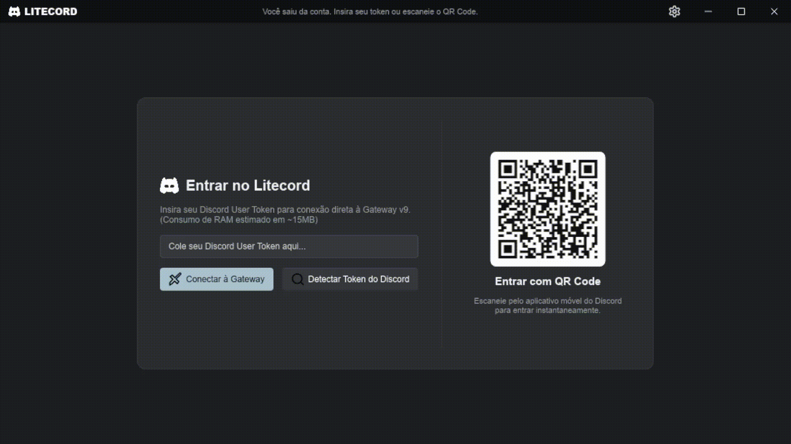
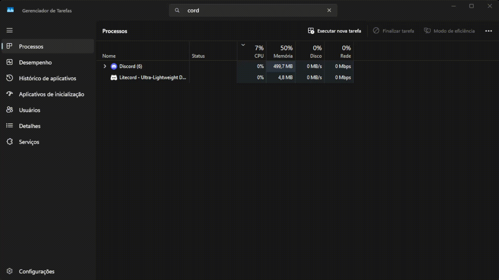



# Litecord 🚀
### Ultra-Lightweight, High-Performance Native Discord Client for Gamers

  <b>Litecord</b> is an ultra-fast, native desktop client for Discord engineered from scratch in <b>Rust</b> for <b>gamers, streamers, and competitive esports players</b>. Running with <b>< 0.1% CPU</b> and <b>~32 MB RAM</b>, it eliminates background micro-stutters and drops zero in-game FPS while providing <b>IGL / Shot-Caller Speech Priority Ducking</b>, <b>Detached Stream Popouts</b>, <b>QR Code Mobile Login</b>, <b>Smart Slash Commands</b>, <b>Unified Emojis</b>, and <b>On-Demand Ephemeral Attachments</b>.

[🌐 Live Website](https://ak4ai.github.io/Litecord/) • [📦 Downloads](#-downloads--releases) • [🎮 Gamer Features](#-why-gamers-choose-litecord) • [⚡ Benchmarks](#-benchmarks-vs-official-discord) • [✨ All Features](#-features-breakdown) • [🛡️ Security & Privacy](#-cybersecurity-privacy--account-safety) • [🛠️ Build from Source](#-building-from-source)

 

---

## 🎮 Why Gamers Choose Litecord

- 🏆 **Zero In-Game FPS Drops & Micro-Stutters**: Reclaims CPU threads eaten by Chromium/Electron, improving 1% low framerates in competitive titles (*CS2, Valorant, Warzone, Apex Legends, Fortnite, League of Legends*).
- 👑 **Squad Leader & IGL Priority Ducking**: Set shot-callers to Priority 2 ([ - ] P:2 [ + ]) so critical tactical callouts automatically duck background chatter and music bots during clutch moments.
- 📺 **Detached Video & Stream Popouts**: Pop out live screen shares and video streams into a dedicated floating Picture-in-Picture (PiP) window with an always-on-top pin.
- 📱 **QR Code Mobile Login**: Log in instantly by scanning a QR code with the official Discord mobile app—no need to manually enter or extract tokens.
- ⌨️ **Smart Slash Commands Autocomplete**: Real-time suggestion indexing for /play, /skip, and server bot commands with keyboard navigation (Up/Down + Enter) and interactive parameter chips.
- 🖼️ **On-Demand Ephemeral Image Attachments**: Minecraft-style pixel-art placeholders (~500 bytes) with dynamic proportional height and zero-residue temp downloads.
- 🎨 **Unified Emoji System (Twemoji + Discord CDN)**: Zero missing tofu squares (□). Full support for Discord custom animated/static emojis and Unicode emojis across chat, embeds, and bot buttons.
- ⚡ **Sub-5 MB DeepSleep RAM**: Drops physical memory footprint down to **~3 MB – 5 MB** when minimized to the system tray, freeing maximum RAM for games.
- 🎙️ **Opus PLC (Packet Loss Concealment)**: Prevents robotic voice stuttering and audio crackles even under 100% CPU/GPU load.
- 🌐 **7 Built-in Languages**: Automatic OS language detection with English, Portuguese, Spanish, German, French, Russian, and Japanese.

---

## ⚡ Benchmarks vs Official Discord

| Metric | Official Discord (Electron) | **Litecord (Native Rust + Slint)** | Gaming Impact |
| :--- | :--- | :--- | :--- |
| **Idle CPU Usage** | 1.5% - 4.5% | **0.00% - 0.02% (DeepSleep: 0.0%)** | 🚀 **150x lighter CPU footprint** |
| **Active Voice CPU** | 4.0% - 8.0% | **~0.1% - 0.3%** | ⚡ **Zero Game Stuttering** |
| **RAM Usage (DeepSleep Tray)** | 350 MB - 750 MB | **~3 MB - 5 MB** | 🌙 **99% lighter background footprint** |
| **RAM Usage (Active Window)** | 500 MB - 900 MB | **~12 MB - 28 MB** | 💾 **Saves up to 850 MB RAM** |
| **Startup Time** | 4.5s - 9.0s | **< 150 ms** | ⏱️ **Instant Match Launch** |
| **Binary Size** | ~180 MB | **~8 MB Standalone** | 📦 **Pure Native Machine Code** |

---

## ✨ Features Breakdown

### 🎙️ 1. Studio-Grade Voice Pipeline & DAVE Protocol (E2EE)
- **True Opus PLC (Packet Loss Concealment)**: Synthesizes missing or delayed audio frames seamlessly, eliminating crackles, micro-stutters, and robotic drops even with packet jitter.
- **Adaptive Jitter Pre-Buffer (40ms)**: Absorbs network fluctuations from music bots (Notch, Lara, Jockie) and unstable connections with zero manual tuning.
- **Studio Soft-Knee Limiter**: Transparent dynamic compression for loud audio peaks and heavy bass without harsh square-wave clipping.
- **Cubic Hermite Resampler**: High-fidelity 48kHz audio interpolation for smooth, crystal-clear voice output.
- **DAVE End-to-End Encryption**: Direct support for Discord's MLS (RFC 9420) voice encryption protocol.
- **Microphone VAD & Sensitivity Test**: Real-time visual audio meter (30 FPS) with adjustable threshold slider saved automatically to .litecord_audio_config.json.

  

 

### 👑 2. Dynamic Speech Priority & Smart Ducking
Take control of crowded voice calls with custom per-user priorities ([ - ] P:N [ + ]):
- **Hierarchical Attenuation**: When multiple people talk at once, lower-priority speakers are automatically attenuated smoothly based on the priority difference (Delta = max_priority - user_priority):
  - **Delta = 1** (e.g., Priority 1 vs 0): Volume reduced to **50%**.
  - **Delta = 2** (e.g., Priority 2 vs 0): Volume reduced to **40%**.
  - **Delta = 3** (e.g., Priority 3 vs 0): Volume reduced to **30%**.
  - **Delta >= 5**: Volume ducked to protection floor (**5% - 10%**).
- **Independent Volume & Mute**: Per-user volume sliders (0% - 200%) and instant mute buttons, saved automatically across sessions.

### 📺 3. Detached Stream Popouts & Screen Sharing
- **Picture-in-Picture Floating Window**: Detach any screen share or video stream into a separate floating window.
- **Always-on-Top Pin**: Keep streams visible over games or other applications.
- **Dedicated Volume & Stream Controls**: Independent volume slider (0-200%) and fullscreen toggle.
- **High-Efficiency Screen Capture**: Ultra-low overhead capture engine for sharing your screen with minimal GPU impact.

### 📱 4. QR Code Remote Auth & Windows DPAPI Security
- **Instant QR Code Login**: Scan the on-screen QR code with your Discord Mobile App (Settings -> Scan QR Code) to log in instantly.
- **Windows DPAPI Encryption at Rest**: Discord tokens stored locally in .litecord_token are encrypted with Windows DPAPI (CryptProtectData), making them unreadable to other user accounts, malware, or background scripts.
- **Direct Discord Connections Only**: No intermediary proxies, third-party relays, or tracking servers. All requests go directly to discord.com endpoints.
- **Shell Injection Shield**: Hyperlinks are strictly validated against an http:// / https:// whitelist and dispatched via native OS APIs (ShellExecuteW / xdg-open)—never through shell interpreters (cmd.exe).

### ⌨️ 5. Intelligent Slash Commands & Parameter Chips
- **Dynamic Server Command Indexing**: Fetches and aggregates real slash commands from registered bots (/play, /skip, /stop, /queue, etc.).
- **Keyboard Navigation**: Use **Up/Down Arrow keys** to cycle through command suggestions and hit **Enter** to auto-select.
- **Interactive Parameter Chips**: Formats commands as clean visual chips in the message input and chat history with parameter placeholders.

### 🖼️ 6. Ultra-Lightweight On-Demand Image Attachments
- **Minecraft Pixel-Art Placeholders**: Low-resolution (~500 bytes) chunky 8-bit preview before downloading.
- **Fixed Width (320px) & Proportional Height**: Dynamically adapts height to match the image's original aspect ratio (16:9, portrait, square).
- **Ephemeral Temp Storage**: Full downloads are saved in %TEMP%/Litecord/temp_images/ and automatically wiped on app startup and shutdown.
- **Collapsed Link Archive**: Image URLs remain accessible inside the collapsed message view without cluttering chat.

### 🎨 7. Unified Emoji System (Twemoji + Discord CDN)
- **Discord Custom Emojis**: Asynchronously downloaded, cached locally, and updated in-place.
- **Twemoji Unicode Rendering**: Direct vector glyph rasterization for Unicode emojis (⏭️, ⏮️, ⏯️, 🔀, 🔁, 🔥, ❤️, etc.), preventing Windows tofu boxes (□).
- **Screen & Active Channel Priority**: Dedicates network bandwidth exclusively to visible chat messages.

### ⚡ 8. DeepSleep Mode & Extreme Efficiency
- **Sub-0.1% CPU Idle**: UI event dispatch loop is decoupled and capped at 30 FPS for microphone meters.
- **System Tray DeepSleep**: Minimizing Litecord to the system tray completely suspends all visual rendering loops while keeping voice audio streaming in background.
- **Delta Badge Fingerprinting**: Sidebar channel member count badges update only on real state changes, preventing unnecessary thread wakeups.
- **In-App Update Checker**: Automatically notifies you when a new release is available on GitHub.

---

## 🛡️ Cybersecurity, Privacy & Account Safety

When choosing an alternative client for Discord, **security and account integrity are paramount**:

### 🔒 1. Zero-Trust Security Architecture
- **Direct Discord Connections Only (Zero Intermediaries):** Litecord connects directly from your machine to official Discord endpoints (https://discord.com/api and wss://gateway.discord.gg). There are **no proxy servers, no third-party APIs, and no telemetry backends**.
- **Windows DPAPI Local Encryption at Rest:** On Windows, session tokens are encrypted locally using the Windows Data Protection API (CryptProtectData). The encrypted .litecord_token file is cryptographically bound to your Windows user logon credentials.
- **Shell Injection & RCE Shield:** Chat hyperlinks are strictly validated against an http:// and https:// protocol whitelist and dispatched directly to your default browser via native OS APIs (ShellExecuteW on Windows / xdg-open on Linux).
- **100% Open Source & Auditable (MIT):** Every single line of Rust code is public and open for community audit.

### ⚠️ 2. Discord Terms of Service (ToS) & Account Safety
- **Strictly Human-Driven (Zero Automation / Selfbots):** Litecord is engineered purely as a lightweight interactive desktop client for human gamers. It contains **no automated scrapers, no auto-responders, no mass-messaging tools, and no bot scripts** that trigger Discord's automated anti-abuse detection heuristics.
- **Official Gateway Protocol Compliance:** Connects via standard Discord Gateway v9 and Voice Gateway v9 channels, emitting normal human-paced interaction events and respecting API rate limits.
- **Transparent ToS Disclaimer:** Like all third-party Discord software (*Vencord, BetterDiscord, Ripcord*), using an alternative client is technically against Discord's Terms of Service. Litecord is provided for performance and educational purposes.

---

## 📦 Downloads & Releases

Pre-compiled production binaries are available under [GitHub Releases](https://github.com/Ak4ai/Litecord/releases):

| Distribution | File | Details |
| :--- | :--- | :--- |
| **🪟 Windows Release (v0.3.0)** | Litecord-v0.3.0-windows-x64.zip | Standalone executable (litecord.exe). Unpack and run anywhere. |
| **🪟 Windows Setup** | Litecord-Setup-x64.exe | Inno Setup installer with Desktop shortcut and uninstaller. |
| **🐧 Linux Standalone** | litecord-linux-x64.tar.gz | Native x86_64 Linux binary compiled with ALSA and System Tray support. |

---

## 🐧 Linux — Quick Install (One-Line)

Open your terminal and paste:

`ash
curl -sSL https://raw.githubusercontent.com/Ak4ai/Litecord/main/install.sh | bash
`

The script will:
1. 📥 Download the latest pre-compiled binary from GitHub Releases automatically
2. 📂 Install it to ~/.local/bin/litecord
3. 🖥️ Create a .desktop entry for your app launcher
4. ✅ Tell you if you need to add ~/.local/bin to your $PATH

> **Requirements:** curl and 	ar (pre-installed on virtually all Linux distros).

---

## 🛠️ Building from Source

### Prerequisites
- **Rust Toolchain**: 2021 Edition or later (
ustup install stable)
- **Cargo**: Included with Rust

### 📦 Run Development Mode
`ash
cargo run
`

### ⚡ Build Optimized Release Binary
`ash
cargo build --release
`
The optimized executable will be located at 	arget/release/litecord.exe (Windows) or 	arget/release/litecord (Linux).

---

## 📂 Project Architecture

`	ext
Litecord/
├── .github/workflows/
│   └── build.yml              # Automated multi-platform CI/CD release workflow
├── assets/                    # Application icons, SVGs, and demo media
│   ├── app_icon.ico           # Windows multi-res icon (16-256px)
│   ├── app_icon.png           # High-resolution PNG app icon
│   ├── arrow-down.svg         # Download attachment icon
│   ├── camera.svg             # Video & stream toggle icon
│   ├── pin.svg                # Always-on-top window pin icon
│   ├── popout.svg             # Detached stream popout icon
│   ├── qr.svg                 # QR remote authentication icon
│   ├── reply.svg              # Message quote / reply icon
│   ├── terminal.svg           # Slash command terminal icon
│   └── globe.svg              # Multi-language selector icon
├── src/
│   ├── main.rs                # App lifecycle, Slint bindings, tray dispatch & message rendering
│   ├── gateway.rs             # Discord Gateway WS, CPAL/Opus voice, DAVE E2EE, ducking & VAD
│   ├── http.rs                # Discord HTTP REST client (guilds, channels, messages, interactions)
│   ├── remote_auth.rs         # QR Code remote login via Discord Mobile App handshake
│   ├── attachment_cache.rs    # Ephemeral image cache & Minecraft pixel-art placeholder generator
│   ├── emoji_cache.rs         # Multi-tier memory/disk cache with Twemoji and Discord CDN support
│   ├── screen_capture.rs      # High-performance screen capture & stream popout engine
│   ├── updater.rs             # Automatic GitHub release update checker
│   ├── i18n.rs                # Internationalization module with 7 languages & OS locale detection
│   └── tray.rs                # Native Windows System Tray integration & DeepSleep hooks
├── ui/
│   └── appwindow.slint        # Modern, fluid, reactive UI declared in Slint (AppWindow & PopoutWindow)
├── build.rs                   # Windows resource compiler for application icon & manifest
├── Cargo.toml                 # Rust dependencies & build target configurations
├── CONTRIBUTING.md            # Contributor guidelines and Pull Request policy
├── index.html                 # Official GitHub Pages web landing page
├── installer.iss              # Inno Setup Windows installer specification
└── README.md                  # Project documentation & reference
`

---

## 🤝 Contributing & Pull Requests

We welcome all developers, gamers, and audio enthusiasts to help build Litecord! 

### 🎯 Project Vision & Philosophy:
Litecord is built to be a **simple, clean, and ultra-lightweight interface for gamers** to use Discord without background lag, high CPU/RAM overhead, or bloat. 
- **Core Track (main)**: Strictly dedicated to performance, low-latency audio, and minimal essentials (< 0.1% CPU, < 35 MB RAM).
- **Alternative Branches & Releases**: Any modifications or experimental features can be published as alternative branches or release tracks.

### 👑 Contributors Hall of Fame
| Contributor | Role / Contributions | Impact |
| :--- | :--- | :--- |
| [**Ak4ai**](https://github.com/Ak4ai) | Project Creator & Lead Maintainer (Core architecture, Slint UI, Audio Pipeline, Ducking Engine, Security) | **100% (Core)** |
| *Your Name Here* | *Submit a Pull Request to be credited here!* | *%* |

---

## 📄 License

Distributed under the **MIT License**. See [LICENSE](LICENSE) for more details.
