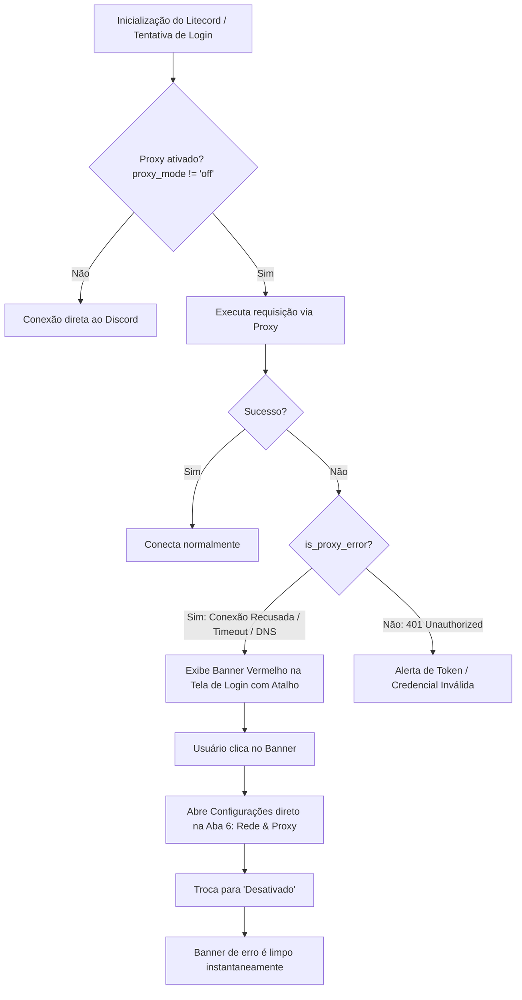

# 🌐 Arquitetura de Rede & Proxy do Litecord

Esta documentação detalha a arquitetura, modelos de dados, fluxo de tráfego e tratamento de erros do sistema de **Rede e Proxy** do Litecord.

---

## 📑 Índice
1. [Visão Geral](#-visão-geral)
2. [Modelos e Estrutura de Dados](#-modelos-e-estrutura-de-dados)
3. [Modos de Conexão Suportados](#-modos-de-conexão-suportados)
4. [Roteamento no Backend (Rust)](#-roteamento-no-backend-rust)
5. [Sistema de Proteção e Diagnóstico de Falhas na Tela de Login](#-sistema-de-proteção-e-diagnóstico-de-falhas-na-tela-de-login)
6. [Ferramenta de Testes Locais (`scripts/test_proxy_server.py`)](#-ferramenta-de-testes-locais)
7. [Integração com VPNs e Redes Mesh (Tailscale, WireGuard)](#-integração-com-vpns-e-redes-mesh)

---

## 🚀 Visão Geral

O Litecord foi projetado para operar com latência mínima e máxima confiabilidade de conexão, mesmo em cenários de rede com restrições severas, como:
- Redes corporativas e escolares com bloqueio de portas do Discord.
- Provedores com bloqueios governamentais ou censura de tráfego.
- Usuários que necessitam de isolamento de IP e anonimização via SOCKS5/Tor/Shadowsocks/V2Ray.

Ao contrário do cliente oficial em Electron (que depende das variáveis de ambiente do sistema e do Chromium), o Litecord implementa um **motor de rede nativo em Rust** com controle granular por sessão, suporte a múltiplos tipos de proxy e recarregamento sem reinicialização da aplicação.

---

## 🗄️ Modelos e Estrutura de Dados

### 1. Arquivo de Persistência Local
As configurações de rede são gravadas em formato JSON no arquivo `.litecord_network_settings.json` na raiz do executável:

```json
{
  "proxy_mode": "off",
  "proxy_host": "127.0.0.1",
  "proxy_port": 8080,
  "proxy_username": "",
  "proxy_password": "",
  "route_media": false
}
```

### 2. Estrutura Rust (`NetworkSettings`)
No módulo `src/utils/network_settings.rs`:

```rust
#[derive(Debug, Clone, Serialize, Deserialize)]
pub struct NetworkSettings {
    pub proxy_mode: String,       // "off", "http", "socks5", "system"
    pub proxy_host: String,       // Ex: "127.0.0.1" ou "proxy.empresa.com"
    pub proxy_port: u16,          // Ex: 8080, 1080
    pub proxy_username: String,   // Autenticação opcional (Basic Auth)
    pub proxy_password: String,   // Senha opcional
    pub route_media: bool,        // Roteamento seletivo de mídias pesadas
}
```

* **Thread-Safety:** A configuração em memória é mantida sob um `Mutex<NetworkSettings>` estático global, acessível através das funções `get_network_settings()`, `save_network_settings()` e `update_network_settings()`.

---

## 🔌 Modos de Conexão Suportados

| Modo | Identificador | Protocolos Suportados | Caso de Uso Típico |
| :--- | :--- | :--- | :--- |
| **Desativado** | `"off"` | Conexão direta TCP/UDP | Padrão. Bypassa qualquer proxy de ambiente (`no_proxy`). |
| **Proxy HTTP / HTTPS** | `"http"` | TCP (CONNECT Tunneling) | Redes empresariais, firewalls corporativos, Fiddler, Burp Suite. |
| **Proxy SOCKS5** | `"socks5"` | TCP e UDP | Shadowsocks, V2Ray, Xray, Tor (`127.0.0.1:9050`), roteamento anônimo. |
| **Proxy do Sistema** | `"system"` | Conforme OS | Respeita as variáveis de ambiente `HTTP_PROXY` / `HTTPS_PROXY` / `ALL_PROXY`. |

---

## ⚙️ Roteamento no Backend (Rust)

### 1. Injeção de Proxy no Cliente HTTP (`apply_proxy_to_builder`)
Toda requisição HTTP REST (`https://discord.com/api/v10/...`) passa pelo construtor centralizado:

```rust
pub fn apply_proxy_to_builder(mut builder: reqwest::ClientBuilder) -> reqwest::ClientBuilder {
    let settings = get_network_settings();
    match settings.proxy_mode.as_str() {
        "http" | "https" => {
            let url = format!("http://{}:{}", settings.proxy_host.trim(), settings.proxy_port);
            if let Ok(mut p) = reqwest::Proxy::all(&url) {
                if !settings.proxy_username.is_empty() {
                    p = p.basic_auth(&settings.proxy_username, &settings.proxy_password);
                }
                builder = builder.proxy(p);
            }
        }
        "socks5" => {
            let url = format!("socks5://{}:{}", settings.proxy_host.trim(), settings.proxy_port);
            if let Ok(mut p) = reqwest::Proxy::all(&url) {
                if !settings.proxy_username.is_empty() {
                    p = p.basic_auth(&settings.proxy_username, &settings.proxy_password);
                }
                builder = builder.proxy(p);
            }
        }
        "system" => { /* Usa variáveis do sistema */ }
        _ => { builder = builder.no_proxy(); }
    }
    builder
}
```

### 2. Recarregamento em Tempo Real (Zero Downtime)
Ao clicar em **"Salvar Configurações"** na interface, o callback `on_save_proxy_settings` em `src/main.rs`:
1. Salva o arquivo JSON de configurações.
2. Reconstrói a instância de `DiscordHttpClient` com os novos parâmetros sem derrubar a sessão ativa ou reiniciar o processo.
3. Se o proxy for desativado (`mode == "off"`), limpa imediatamente qualquer alerta de erro pendente na interface.

### 3. Teste de Conexão com Diagnóstico de Latência
A função `test_proxy_connection()` dispara um `GET` assíncrono para `https://discord.com/api/v10/gateway` com timeout de 6 segundos:
- Cronometra a latência real de ida e volta (`Instant::now().elapsed()`).
- Retorna código HTTP e tempo em milissegundos para a UI (exibido na caixa verde).
- Em caso de falha, captura o erro original do sistema operacional (ex: erro `10061` no Windows ou `111` no Linux) e formata uma mensagem clara.

---

## 🛡️ Sistema de Proteção e Diagnóstico de Falhas na Tela de Login

Um dos maiores problemas enfrentados por usuários de proxy é abrir o aplicativo com o proxy configurado desligado, o que travava o login sem explicações claras.

O Litecord resolve isso com um sistema triplo de detecção:



### Principais Recursos de UI do Banner:
* **Responsividade Dinâmica:** Altura elástica (`min-height: 38px`) e quebra de palavras (`wrap: word-wrap`) para que mensagens de erro detalhadas nunca sejam cortadas.
* **Ação em 1 Clique:** Clicar em qualquer ponto do banner abre a janela de configurações instantaneamente na aba de **Rede & Proxy** (`settings_active_tab = 6`).
* **Acesso Global pelo Título:** O ícone de engrenagem ⚙️ na barra de título do aplicativo permanece acessível mesmo na tela de login deslogada.

---

## 🧪 Ferramenta de Testes Locais

Para desenvolvedores e testes locais, o projeto inclui um servidor proxy HTTP/HTTPS completo em Python:
[`scripts/test_proxy_server.py`](../scripts/test_proxy_server.py)

### Como rodar o proxy de teste:
```bash
python scripts/test_proxy_server.py
```
- Inicia na porta `127.0.0.1:8080`.
- Suporta túneis `CONNECT` de alta performance com logs em tempo real do tráfego do Discord.
- No Litecord, selecione **Proxy HTTP / HTTPS**, informe `127.0.0.1:8080` e clique em **"Testar Conexão"**.

---

## 🔗 Integração com VPNs e Redes Mesh

* **Tailscale Exit Nodes:** Se você utiliza o Tailscale no computador com um Exit Node ativado, o Litecord operará em modo "Desativado" ou "Proxy do Sistema", utilizando a interface virtual WireGuard automaticamente.
* **Nós Remotos Tailscale:** É possível apontar o Litecord para o IP Tailscale (`100.x.y.z`) de outra máquina na sua malha privada que rode um serviço de proxy (como Dante SOCKS5 ou Squid), obtendo criptografia ponta a ponta sem expor portas para a internet pública.
